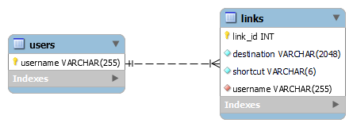

# Database Design

## Introduction

The URL (link) shortener enables registered users to add/remove shortened URLs and anyone with the shortcut can retrieve the full URL. The following is a list of identified user stories:

A registered user can

- Sign in & sign out, using FCS LDAP server for authentication
- View the URLs associated with the account
- Delete URLs belong to the account
- Create a short URL associated with the account by providing the destination URL

A user of short link can

- Use the short URL to visit the long URL

This document outlines the ER diagram and the descriptions of stored procedures necessary for handling data in the database. We use Agile approaches to manage our project; therefore, the database design may evolve over time.

## Entity Relationship

The database for the project consists of two database tables, `users` and `links`. The `users` table is used for storing account information of registered users. It has only one attribute: `username` as the primary key. The `links` table contains information about the URL, including `link_id`, `destination`, `shortcut` and `username` attributes. `link_id` is the primary key. `destination` is the long URL, `shortcut` is the shortened alias for the original link, also known as short link. `shortcut` needs to be unique to identify the corresponding `destination`. `destination` doesn’t have to be unique to ensure separation of each link creation. `username` is a foreign key referencing the `username` attribute in the `users` table. If the user who created the link is deleted, the link associated with the user should also be deleted, we’ll use `ON DELETE CASCADE` to achieve this.

## List of Stored Procedures

`addUser` adds a new user in the database after LDAP authentication. Accepts `username` as input and inserts a new record into the `users` table if it doesn’t already exist.

`createLink` creates a new short link. Accepts the original URL and `username` as input, generates a unique shortcut, and adds a new entry to the `links` table.

`deleteLink` deletes a specific link. Accepts `link_id` as input and removes the corresponding record from the `links` table.

`getUserLinks` retrieves all links created by a specific user. Takes `username` as input and returns all associated records from the `links` table.

`getLinkDestination` retrieves the original long URL. Takes `shortcut` as input and returns `destination` from the `links` table.
